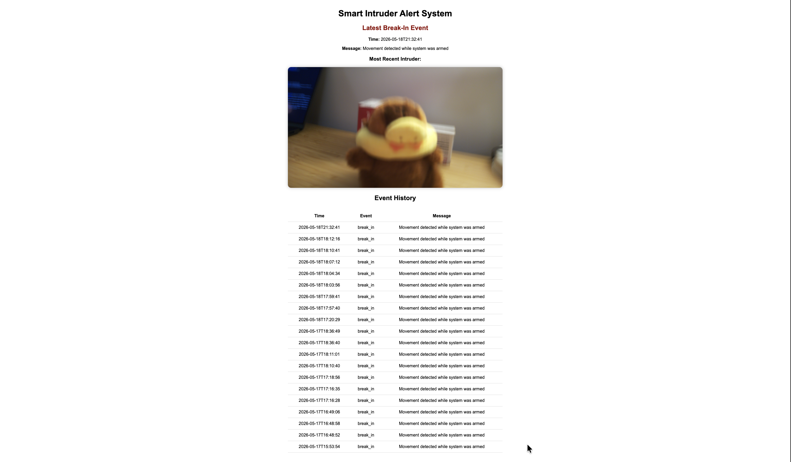
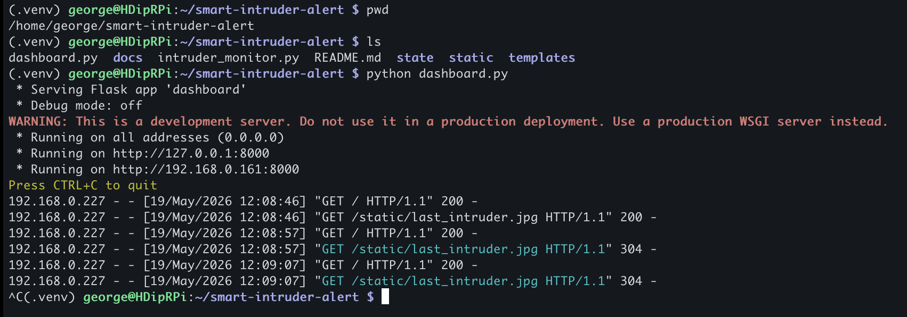
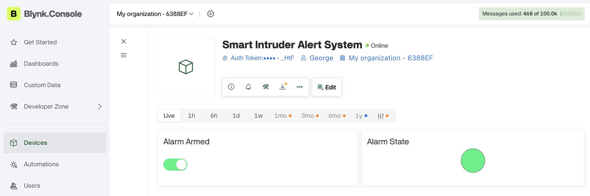
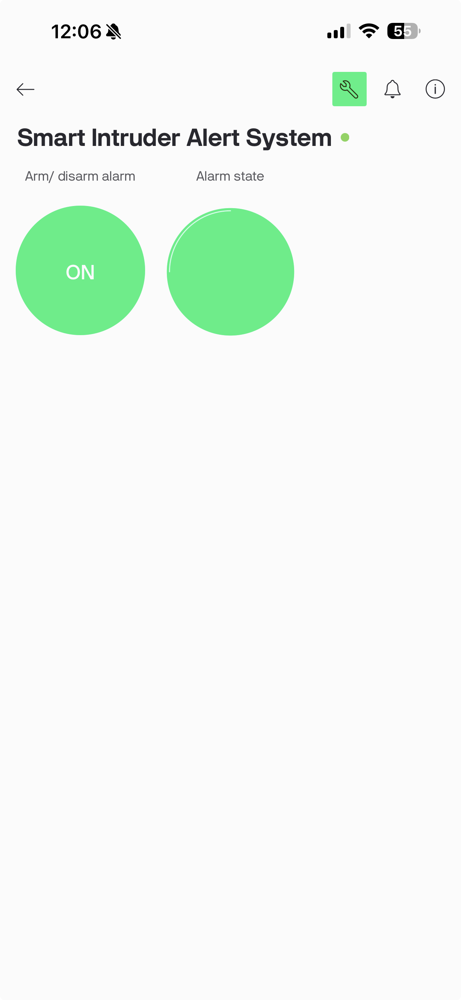
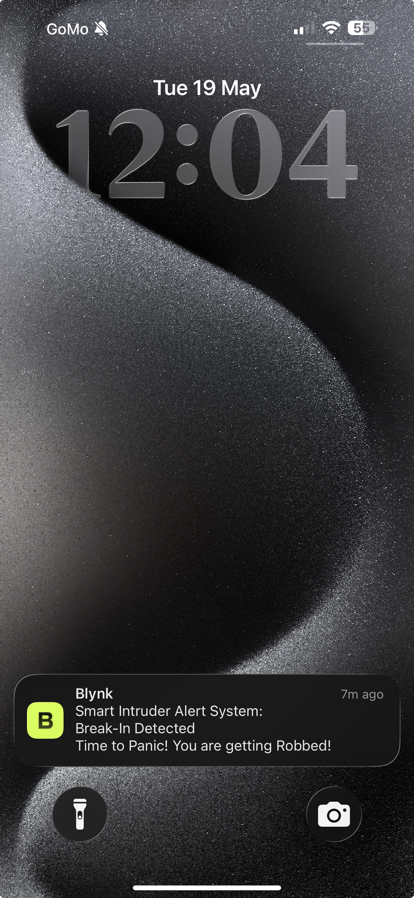
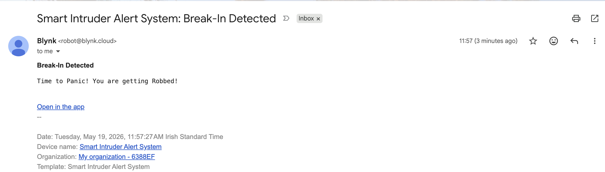
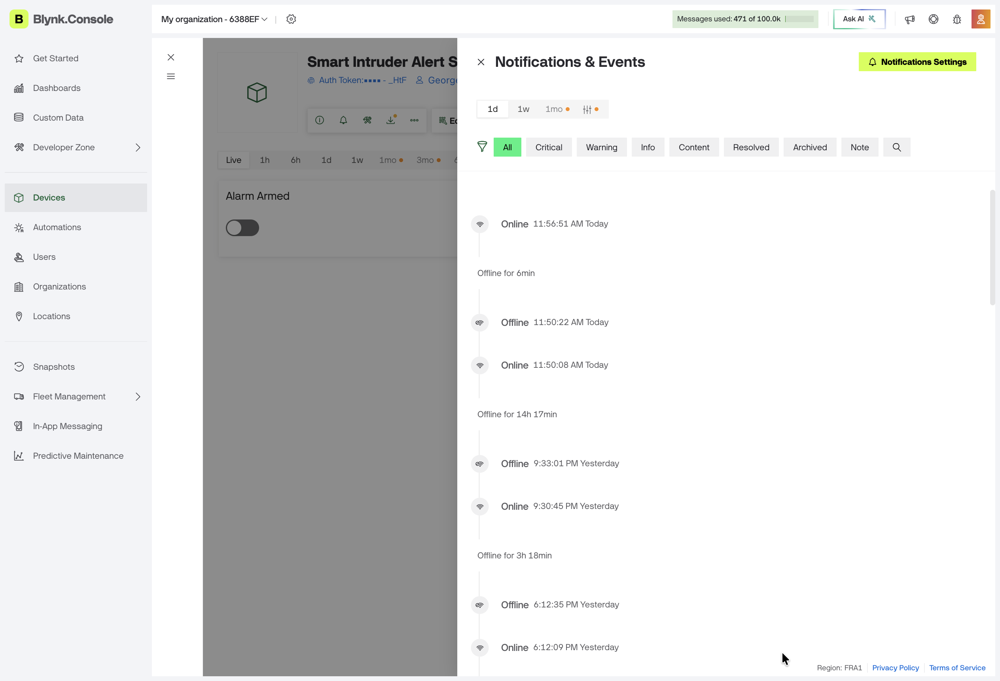
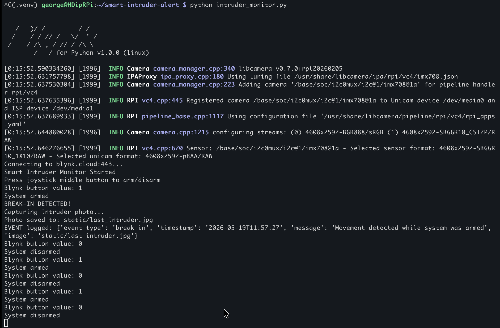

# Smart Intruder Alert System

## Project Description

This project is an IoT-based smart intruder alert system built using a Raspberry Pi, Sense HAT, Flask, Blynk, and Python.

The system detects movement using the Sense HAT accelerometer. When movement is detected while the system is armed, the Raspberry Pi:

- triggers a visual alarm using the LEDs 
- captures the image of the intruder using the Raspberry Pi Camera Module
- logs the event to a JSON file
- sends push and email notifications using Blynk
- displays the latest event on a Flask web dashboard

## Features

- Motion detection using Sense HAT accelerometer
- Arm/disarm system using joystick on the Raspberry Pi
- Arm/disarm remotely using the Blynk web or mobile app
- LED visual alarm system on the Raspberry Pi
- Intruder's image captured by the camera module
- JSON event logging
- Flask web dashboard
- Blynk push and email notifications
- Event history display on the web dashboard

## Technologies

- Raspberry Pi 4
- Sense HAT
- Pi Camera Module
- Python 3
- Flask
- JSON
- Blynk
- Git and GitHub

## Installation

1. Clone the repository

2. Navigate to the project folder

   `cd smart-intruder-alert`

3. Create and activate a Python virtual environment

   `python3 -m venv .venv`

   `source .venv/bin/activate`

4. Install the required packages

   `pip install flask blynklib sense-hat picamera2`

5. Configure the Blynk authentication token

   `export BLYNK_AUTH=YOUR_TOKEN_HERE`

6. Run the intruder monitoring system

   `python intruder_monitor.py`

7. Run the Flask dashboard

   `python dashboard.py`

8. Open a browser and navigate to:

   `http://<raspberry-pi-ip>:8000`

## Architecture

The system follows a simple IoT architecture:

1. The Sense HAT accelerometer continuously monitors for movement.

2. The user arms or disarms the system using either:
  - The Sense HAT joystick
  - The Blynk mobile app
  - The Blynk web dashboard

3. When movement is detected while the system is armed:
  - An alarm is triggered
  - The Raspberry Pi Camera captures an image
  - The event is logged to a JSON file
  - Blynk sends push and email notifications

4. The Flask dashboard displays:
  - The latest intruder image
  - The latest break-in event
  - Recent event history

## Screenshots

### Flask Dashboard

The Flask dashboard displays the latest break-in event, the most recent intruder image, and a history of previous events.

---

### Flask Terminal Output

Terminal output showing the Flask web server running on the Raspberry Pi.

---

### Blynk Web Dashboard

The Blynk web dashboard allows the system to be armed and disarmed remotely while also displaying the current alarm state.

---

### Blynk Mobile App

The mobile application provides remote control of the alarm system from a smartphone.

---

### Push Notification Alert

Push notification sent to the phone when a break-in is detected.

---

### Email Notification Alert

Email notification generated automatically by Blynk after movement is detected.

---

### Blynk Notifications and Events

Blynk event history showing online/offline status and system activity.

---

### Blynk Terminal Output

Terminal output showing the intruder monitoring system running and detecting movement events.

													

## Future Improvements

- Cloud storage for event logs and images
- Additional sensors such as PIR motion detectors
- User authentication for the Flask dashboard
- SMS notifications
- Option to view all past break-in events through the dashboard
- Allow users to view previous intruder photos through the dashboard

## Status

Project completed and tested successfully.
